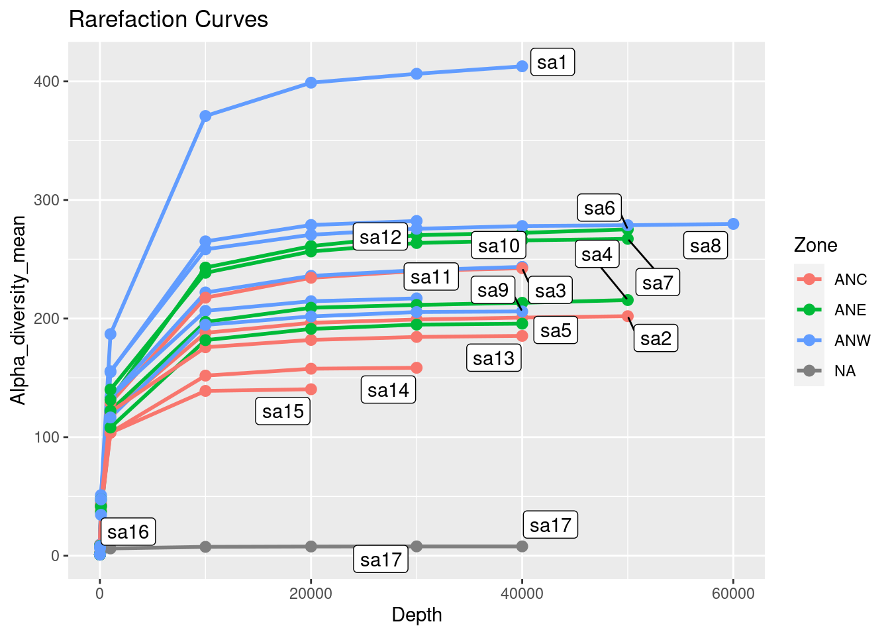
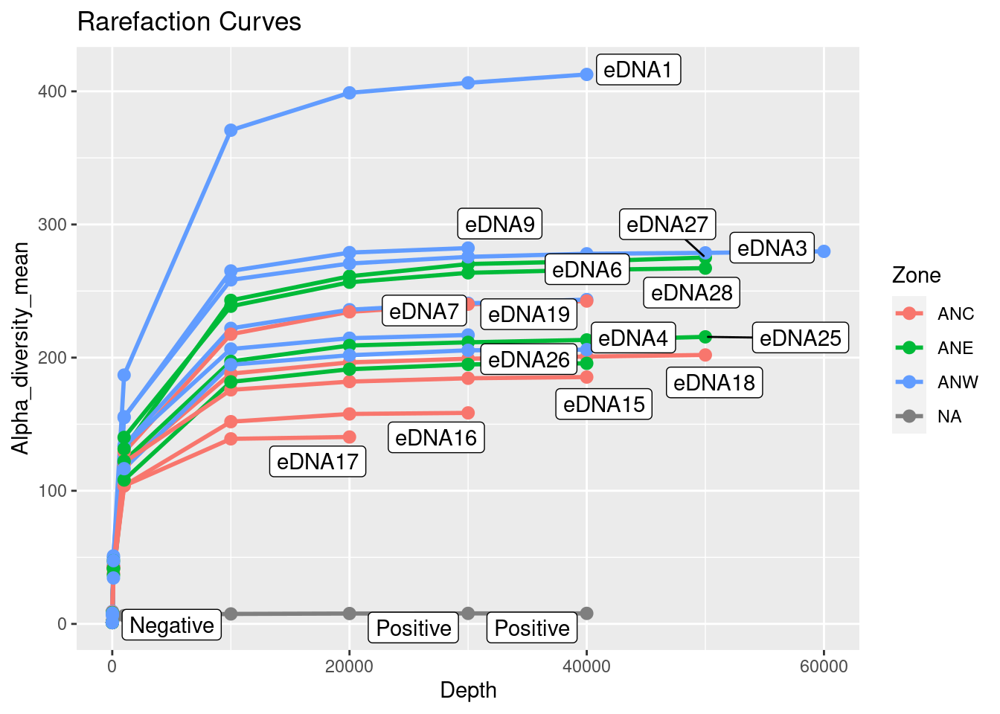
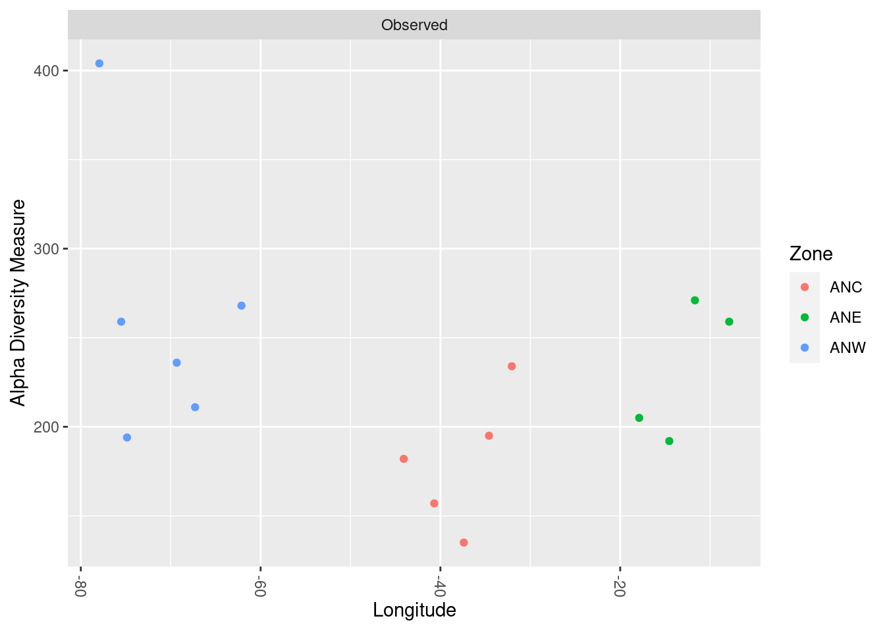
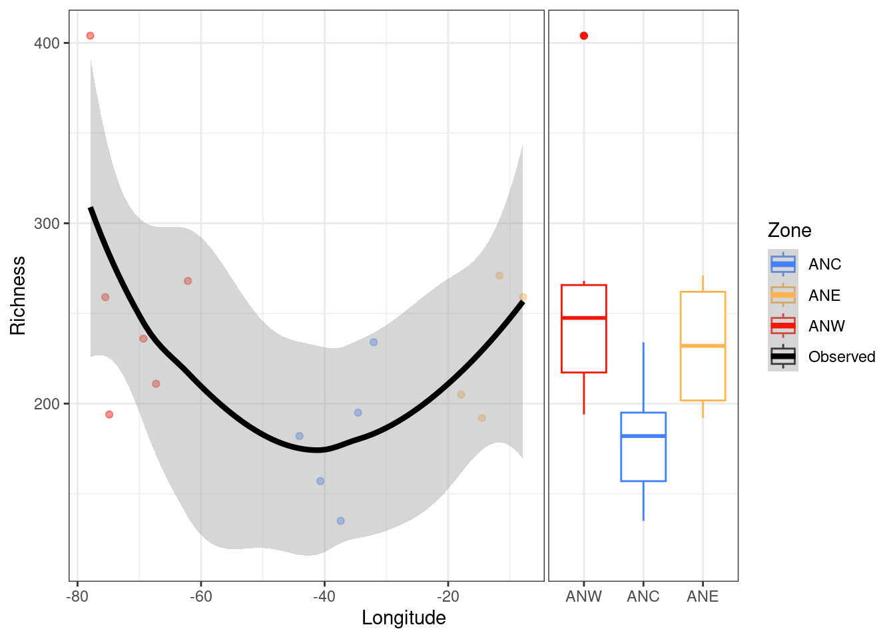
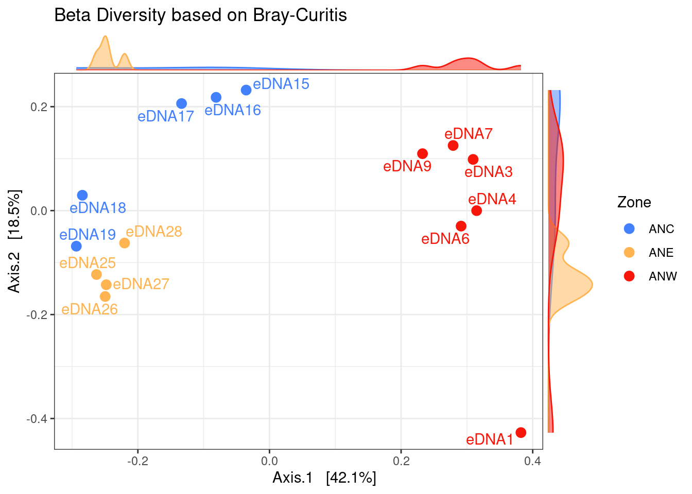
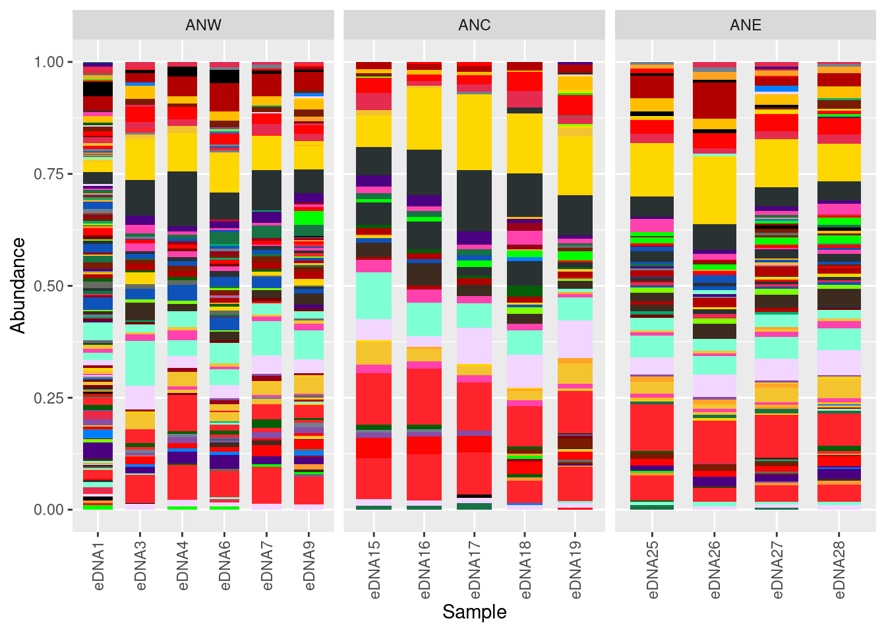
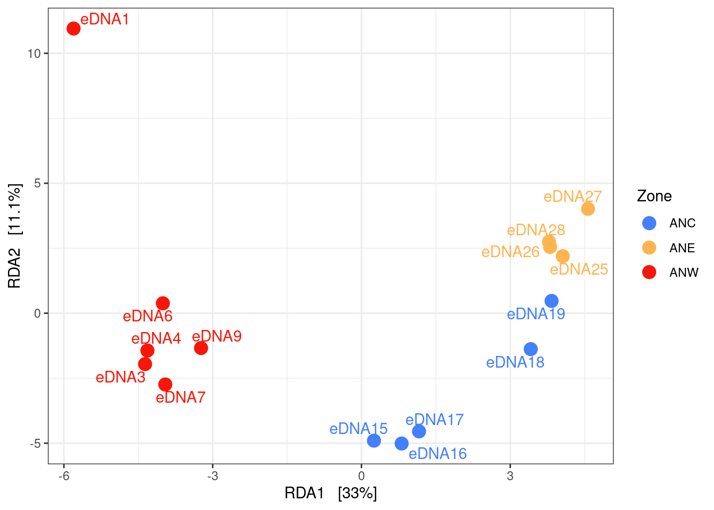
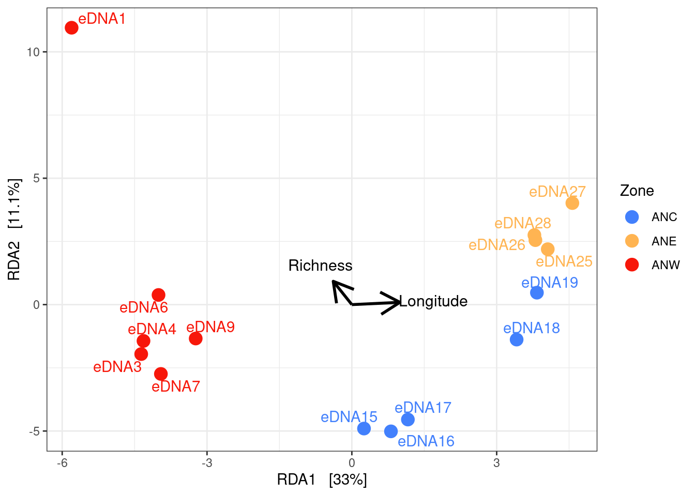

### SEA4BLUE Project

<p align="center">
  
</p>

Sail4Blue samples were collected in North Atlantic Ocean, from Florida to the Azores (longitudinal transect), during May and June 2022 as illustrated in the figure above. The samples were collected using the eDNA Citizen Scientist Sampler with the Self-preserving eDNA Filter. Each sample corresponds to 8 to 10 liters of filtered water. The filters were stored at room temperature (RT), and DNA was extracted using the DNeasy PowerWater kit by Qiagen.


<p align="center">
  
</p>
The 16S rRNA gene V4 region was amplified starting with 5 ng of each sample 

---

## The data we will use has already been 'pre-processed' with DADA2 and the taxonomy was assigned using Silva DB

<details>
<summary>What are the 'pre-processing' steps needed to clean the raw reads?</summary>
<br>
Inspect read quality profiles<br>
Remove Adaptors<br>
Quality filter and trimming<br>
Sample Inference<br>
Merge paired reads<br>
Remove chimeras<br>
</details>

---

<details>
<summary>What are the outputs of DADA2?</summary>
<br>
ASVs table & Rapresentative Sequences
</details>

---

<details>
<summary>What are the inputs for Phyloseq?</summary>
<br>
ASVs table + Rapresentative Sequences + taxonomy table + metadata
</details>


---
---
---


## now open **analysis_sea4blue.R** in your R cloud


#load packages
```r
library(MiscMetabar)
library(formattable)
library(phyloseq)
library(ggplot2)
library(dplyr)
library(metagenomeSeq)
library(ggrepel)
library(ranacapa)
library(ggside)
library(ggpubr)
library(grid)
```
#import data for the phyloseq object ( ASVs table, Tax table, metadata table)
```r
ps <- read_pq(path = "sea4blue_phyloseq") #this function import all the files from a specified folder 

ps
```

```
## phyloseq-class experiment-level object
## otu_table()   OTU Table:         [ 1312 taxa and 17 samples ]
## sample_data() Sample Data:       [ 17 samples by 9 sample variables ]
## tax_table()   Taxonomy Table:    [ 1312 taxa by 6 taxonomic ranks ]
```
# the metadata
```r 
sample_data(ps)
```

```
##             X    IndexSequence SampleName NavigationDay       Date        Water Zone Latitude  Longitude
## sa1     eDNA1 TACTAGGTAAGCAGCA      eDNA1             1 23/05/2022 Superficiale  ANW 29.30070 -77.936917
## sa2    eDNA18 TAACGTCCACGCGTGA     eDNA18            18 09/06/2022 Superficiale  ANC 35.79043 -34.595667
## sa3    eDNA19 TACTAGGTTGCGTCAC     eDNA19            19 10/06/2022 Superficiale  ANC 36.99627 -32.055683
## sa4    eDNA25 ACGTACGTTGCGTCAC     eDNA25            25 23/06/2022 Superficiale  ANE 35.89713 -17.887783
## sa5    eDNA26 GCGATACGTGCGTCAC     eDNA26            26 24/06/2022 Superficiale  ANE 36.13633 -14.540200
## sa6    eDNA27 TACTAGGTGTCTAGTG     eDNA27            27 25/06/2022 Superficiale  ANE 36.25035 -11.687733
## sa7    eDNA28 ACGTACGTGTCTAGTG     eDNA28            28 26/06/2022 Superficiale  ANE 36.07880  -7.874533
## sa8     eDNA3 ACGTACGTAAGCAGCA      eDNA3             3 25/05/2022 Superficiale  ANW 30.65897 -75.508383
## sa9     eDNA4 GCGATACGAAGCAGCA      eDNA4             4 26/06/2022 Superficiale  ANW 31.18923 -74.859950
## sa10    eDNA6 GTTACAGCAAGCAGCA      eDNA6             6 28/05/2022 Superficiale  ANW 31.75563 -69.329683
## sa11    eDNA7 TAACGTCCAAGCAGCA      eDNA7             7 29/05/2022 Superficiale  ANW 31.82482 -67.287833
## sa12    eDNA9 TACTAGGTACGCGTGA      eDNA9             9 31/05/2022 Superficiale  ANW 31.99925 -62.128333
## sa13   eDNA15 ACGTACGTACGCGTGA     eDNA15            15 06/06/2022 Superficiale  ANC 34.21340 -44.076200
## sa14   eDNA16 GCGATACGACGCGTGA     eDNA16            16 07/06/2022 Superficiale  ANC 34.55028 -40.685317
## sa15   eDNA17 GTTACAGCACGCGTGA     eDNA17            17 08/06/2022 Superficiale  ANC 35.44867 -37.395217
## sa16 Negative GCGATACGGTCTAGTG   Negative            NA       <NA> Superficiale <NA>       NA         NA
## sa17 Positive GTTACAGCGTCTAGTG   Positive            NA       <NA> Superficiale <NA>       NA         NA
```


# LET'S VISUALIZE RAREFACTION CURVES 

# do you remember?

<p align="center">
  
</p>


```r
# define a new ps object called psdata that will be used in the following function
ps
```

```
## phyloseq-class experiment-level object
## otu_table()   OTU Table:         [ 1312 taxa and 17 samples ]
## sample_data() Sample Data:       [ 17 samples by 9 sample variables ]
## tax_table()   Taxonomy Table:    [ 1312 taxa by 6 taxonomic ranks ]
```

```r
#### define  the function calculate_rarefaction_curves

calculate_rarefaction_curves <- function(psdata, measures, depths) {
  require('plyr') # ldply
  require('reshape2') # melt
  
  estimate_rarified_richness <- function(psdata, measures, depth) {
    if(max(sample_sums(psdata)) < depth) return()
    psdata <- prune_samples(sample_sums(psdata) >= depth, psdata)
    
    rarified_psdata <- rarefy_even_depth(psdata, depth, verbose = FALSE)
    
    alpha_diversity <- estimate_richness(rarified_psdata, measures = measures)
    
    # as.matrix forces the use of melt.array, which includes the Sample names (rownames)
    molten_alpha_diversity <- melt(as.matrix(alpha_diversity), varnames = c('Sample', 'Measure'), value.name = 'Alpha_diversity')
    
    molten_alpha_diversity
  }
  
  names(depths) <- depths # this enables automatic addition of the Depth to the output by ldply
  rarefaction_curve_data <- ldply(depths, estimate_rarified_richness, psdata = psdata, measures = measures, .id = 'Depth', .progress = ifelse(interactive(), 'none', 'none'))
  
  # convert Depth from factor to numeric
  rarefaction_curve_data$Depth <- as.numeric(levels(rarefaction_curve_data$Depth))[rarefaction_curve_data$Depth]
  
  rarefaction_curve_data
}
```
#### use the function calculate_rarefaction_curves on ps
```r
rarefaction_curve_data <- calculate_rarefaction_curves(ps, c('Observed'), rep(c(1, 10, 100, 1000, 1:100 * 10000), each = 10))
```
#print the summary
```
summary(rarefaction_curve_data)
```

```
##      Depth           Sample        Measure     Alpha_diversity
##  Min.   :    1   sa8    :100   Observed:1310   Min.   :  1.0  
##  1st Qu.:   10   sa2    : 90                   1st Qu.:  9.0  
##  Median : 1000   sa4    : 90                   Median :137.0  
##  Mean   :13266   sa6    : 90                   Mean   :130.2  
##  3rd Qu.:30000   sa7    : 90                   3rd Qu.:215.0  
##  Max.   :60000   sa1    : 80                   Max.   :416.0  
##                  (Other):770
```
# do some calculations  and merge the data for plotting
```r 
rarefaction_curve_data_summary <- ddply(rarefaction_curve_data, c('Depth', 'Sample', 'Measure'), summarise, Alpha_diversity_mean = mean(Alpha_diversity), Alpha_diversity_sd = sd(Alpha_diversity))

rarefaction_curve_data_summary_verbose <- merge(rarefaction_curve_data_summary, 
                                                data.frame(sample_data(ps)), 
                                                by.x = 'Sample', by.y = 'row.names')


```
### plot with ggplot
```
ggplot(data=rarefaction_curve_data_summary_verbose, aes(x = Depth, 
                                                        y = Alpha_diversity_mean, 
                                                        group = Sample, color = Zone)) +
  geom_line(aes(group = Sample), size = 1) +
  geom_point(size = 2.5) +
  geom_label_repel(data = rarefaction_curve_data_summary_verbose %>% 
      group_by(Sample) %>% 
      filter(Alpha_diversity_mean == max(Alpha_diversity_mean)), 
    aes(Depth, Alpha_diversity_mean,  label = ( Sample)),
    color = "black"  )+ggtitle("Rarefaction Curves")
```




## there is something strange with sample 16 and 17 could you guess why
```

ggplot(data=rarefaction_curve_data_summary_verbose, aes(x = Depth, 
                                                        y = Alpha_diversity_mean, 
                                                        group = Sample, color = Zone)) +
  geom_line(aes(group = Sample), size = 1) +
  geom_point(size = 2.5) +
  geom_label_repel(data = rarefaction_curve_data_summary_verbose %>% 
                     group_by(Sample) %>% 
                     filter(Alpha_diversity_mean == max(Alpha_diversity_mean)), 
                   aes(Depth, Alpha_diversity_mean,  label = ( SampleName )), #changing the parameter of the labels
                   color = "black"  )+ggtitle("Rarefaction Curves")
```




# *do you see some patterns???????*


# NORMALIZATION     


```
phyloseq_obj<-ps
```
# search for Mitochondria
```
grep(pattern = "Mitochondria", tax_table(phyloseq_obj)) 
```

```
##  [1] 5985 6020 6044 6099 6101 6121 6185 6257 6296 6334 6381 6415 6422 6431 6454 6460 6461 6493 6504 6509 6513 6526 6529
```
#search for Chloroplast
```r

grep(pattern = "Chloroplast", tax_table(phyloseq_obj)) 
```

```
##  [1] 4095 4107 4133 4179 4184 4229 4236 4249 4261 4285 4301 4305 4326 4352 4358 4376 4396 4432 4439 4448 4460 4468 4487 4520 4533 4584 4590 4600 4618
## [30] 4655 4668 4696 4747 4751 4763 4764 4772 4777 4813 4815 4822 4825 4891 4936 4951 4964 4994 4999 5017 5025 5029 5053 5083 5095 5125 5127 5143 5168
## [59] 5247 5248
```
#remove Chloroplast and Mitochondria from phyloseq_obj
```r

phyloseq_obj <- phyloseq_obj %>% subset_taxa( Family!= "Mitochondria" | is.na(Family) & Order!="Chloroplast" | is.na(Order) ) 

phyloseq_obj
```

```
## phyloseq-class experiment-level object
## otu_table()   OTU Table:         [ 1229 taxa and 17 samples ]
## sample_data() Sample Data:       [ 17 samples by 9 sample variables ]
## tax_table()   Taxonomy Table:    [ 1229 taxa by 6 taxonomic ranks ]
```

```r
#filtering singletons
doubleton <- genefilter_sample(phyloseq_obj, filterfun_sample(function(x) x > 1), A=1)
doubleton <- prune_taxa(doubleton, phyloseq_obj) 
doubleton
```

```
## phyloseq-class experiment-level object
## otu_table()   OTU Table:         [ 1226 taxa and 17 samples ]
## sample_data() Sample Data:       [ 17 samples by 9 sample variables ]
## tax_table()   Taxonomy Table:    [ 1226 taxa by 6 taxonomic ranks ]
```
## rimuovo i pos e neg
```r
sample_variables(doubleton)
```

```
## [1] "X"             "IndexSequence" "SampleName"    "NavigationDay" "Date"          "Water"         "Zone"          "Latitude"      "Longitude"
```

#rimuovo i positivi e negativi
```r
doubleton = subset_samples(doubleton,!( SampleName=="Positive" | SampleName=="Negative"))
```
#check it
```
sample_data(doubleton)$SampleName
```

```
##  [1] "eDNA1"  "eDNA18" "eDNA19" "eDNA25" "eDNA26" "eDNA27" "eDNA28" "eDNA3"  "eDNA4"  "eDNA6"  "eDNA7"  "eDNA9"  "eDNA15" "eDNA16" "eDNA17"
```
# transforming 
```r
data.metagenomeSeq = phyloseq_to_metagenomeSeq(doubleton)

p = cumNormStat(data.metagenomeSeq) #default is 0.5
```

```
## Default value being used.
```

```r
data.cumnorm = cumNorm(data.metagenomeSeq, p=p)
#data.cumnorm
data.CSS = MRcounts(data.cumnorm, norm=TRUE, log=TRUE)
head(data.CSS)
```

```
##           sa1       sa2      sa3      sa4      sa5      sa6      sa7       sa8       sa9      sa10      sa11      sa12      sa13      sa14      sa15
## ASV1  0.00000 11.828152 12.19976 12.66877 12.24073 13.19269 12.15724  0.000000  0.000000  0.000000  0.000000  5.355944 11.116552 11.498655 10.002494
## ASV2  7.39927 10.901037 10.99427 10.87241 10.86409 10.57588 11.78722 11.474883 10.640084 11.174908 10.077608 11.283342 10.297447 10.571002 10.529610
## ASV3  6.62417 10.637374 11.00867 10.21290 11.45207 11.44724 10.18808 10.186246  9.564125 12.069720  9.619774  9.572272  9.358591 10.793806 10.334375
## ASV4  0.00000  0.000000  0.00000  0.00000  0.00000  0.00000  0.00000  0.000000  0.000000  0.000000  0.000000  0.000000  0.000000  0.000000  0.000000
## ASV5 10.09764  0.000000  0.00000  0.00000  0.00000  0.00000  0.00000 11.113797 13.594248  8.464959 10.983235  9.345501  9.750342  9.810939  7.161002
## ASV6  4.88065  8.962567 10.57447  9.81946 11.34114 11.12890  9.10309  9.090098  7.473292 11.290277  8.813246  9.115442  8.910191 10.029121  9.543246
```

```r
dim(data.CSS)  # make sure the data are in a correct formal: number of samples in rows
```

```
## [1] 1226   15
```

```r
phyloseq_obj_css <- phyloseq_obj
otu_table(phyloseq_obj_css) <- otu_table(data.CSS, taxa_are_rows = T)

phyloseq_obj_css
```

```
## phyloseq-class experiment-level object
## otu_table()   OTU Table:         [ 1226 taxa and 15 samples ]
## sample_data() Sample Data:       [ 15 samples by 9 sample variables ]
## tax_table()   Taxonomy Table:    [ 1226 taxa by 6 taxonomic ranks ]
```
# change sample names to the correct ones
```r
sample_names(phyloseq_obj_css)<-sample_data(phyloseq_obj_css)$SampleName 

sample_names(phyloseq_obj_css)
```

```
##  [1] "eDNA1"  "eDNA18" "eDNA19" "eDNA25" "eDNA26" "eDNA27" "eDNA28" "eDNA3"  "eDNA4"  "eDNA6"  "eDNA7"  "eDNA9"  "eDNA15" "eDNA16" "eDNA17"
```

# this is the phyloseq object normalized
```r
phyloseq_obj_css
```

```
## phyloseq-class experiment-level object
## otu_table()   OTU Table:         [ 1226 taxa and 15 samples ]
## sample_data() Sample Data:       [ 15 samples by 9 sample variables ]
## tax_table()   Taxonomy Table:    [ 1226 taxa by 6 taxonomic ranks ]
```


### ALPHA DIVERSITY


# round normalized counts for alpha diversity
```r
phyloseq_obj_css_round <- phyloseq_obj_css
otu_table(phyloseq_obj_css_round) <- round(otu_table(phyloseq_obj_css), digits = 0)
```
# check it out
```
head(otu_table(phyloseq_obj_css))
```

```
## OTU Table:          [6 taxa and 15 samples]
##                      taxa are rows
##         eDNA1    eDNA18   eDNA19   eDNA25   eDNA26   eDNA27   eDNA28     eDNA3     eDNA4     eDNA6     eDNA7     eDNA9    eDNA15    eDNA16    eDNA17
## ASV1  0.00000 11.828152 12.19976 12.66877 12.24073 13.19269 12.15724  0.000000  0.000000  0.000000  0.000000  5.355944 11.116552 11.498655 10.002494
## ASV2  7.39927 10.901037 10.99427 10.87241 10.86409 10.57588 11.78722 11.474883 10.640084 11.174908 10.077608 11.283342 10.297447 10.571002 10.529610
## ASV3  6.62417 10.637374 11.00867 10.21290 11.45207 11.44724 10.18808 10.186246  9.564125 12.069720  9.619774  9.572272  9.358591 10.793806 10.334375
## ASV4  0.00000  0.000000  0.00000  0.00000  0.00000  0.00000  0.00000  0.000000  0.000000  0.000000  0.000000  0.000000  0.000000  0.000000  0.000000
## ASV5 10.09764  0.000000  0.00000  0.00000  0.00000  0.00000  0.00000 11.113797 13.594248  8.464959 10.983235  9.345501  9.750342  9.810939  7.161002
## ASV6  4.88065  8.962567 10.57447  9.81946 11.34114 11.12890  9.10309  9.090098  7.473292 11.290277  8.813246  9.115442  8.910191 10.029121  9.543246
```

```r
head(otu_table(phyloseq_obj_css_round))
```

```
## OTU Table:          [6 taxa and 15 samples]
##                      taxa are rows
##      eDNA1 eDNA18 eDNA19 eDNA25 eDNA26 eDNA27 eDNA28 eDNA3 eDNA4 eDNA6 eDNA7 eDNA9 eDNA15 eDNA16 eDNA17
## ASV1     0     12     12     13     12     13     12     0     0     0     0     5     11     11     10
## ASV2     7     11     11     11     11     11     12    11    11    11    10    11     10     11     11
## ASV3     7     11     11     10     11     11     10    10    10    12    10    10      9     11     10
## ASV4     0      0      0      0      0      0      0     0     0     0     0     0      0      0      0
## ASV5    10      0      0      0      0      0      0    11    14     8    11     9     10     10      7
## ASV6     5      9     11     10     11     11      9     9     7    11     9     9      9     10     10
```
# let's focus on richeness (number of species) and let's check its variation along the longitudinal transect

```r

plot_richness(physeq_normalized,x="Longitude",color = "Zone",measures=c("Observed"))
```



```r
p1<-plot_richness(physeq_normalized,x="Longitude",color = "Zone",measures=c("Observed"))

#change the order of 
newSTorder = c( "ANW","ANC","ANE")
p1$data$Zone<- as.character(p1$data$Zone)
p1$data$Zone <- factor(p1$data$Zone, levels=newSTorder) 
```

#plot

```
ggplot(p1$data,aes(Longitude,value))+
  theme_bw()+theme(plot.title = element_text(hjust = 0.5))+
  geom_point(aes(colour = Zone),alpha =0.45)+
  scale_color_manual(values=c("#4280fc", "#ffb452","#f7170a","#000000"))+
  geom_ysideboxplot(aes(x=Zone,y=value,colour = Zone), orientation = "x")+
  theme(        ggside.panel.scale.y = .4)+scale_ysidex_discrete()+
  geom_smooth(aes(colour = variable ),linewidth=1.5)+ ylab('Richness') 
```

```
## `geom_smooth()` using method = 'loess' and formula = 'y ~ x'
```



```r
#let's add the richness to our metadata, maybe will be useful later...
sample_data(phyloseq_obj_css)$Richness<-p1$data$value


#######################################
#######     BETA DIVERSITY      #######
#######################################


### calculate bray-curtis dissimilarity among our samples

otu.ord <- ordinate(physeq = phyloseq_obj_css, "PCoA", distance = "bray")


#plot ordination

plot_ordination(phyloseq_obj_css, otu.ord,  color="Zone",axes =c(1,2))+
  scale_color_manual(values = c("#4280fc", "#ffb452","#f7170a"))+ geom_point(size=3)+ 
  geom_text_repel(aes(label=SampleName),max.overlaps = Inf, show.legend = FALSE)+ 
  theme_void()+
  theme_bw() + 
  geom_xsidedensity(aes(y=stat(density),fill=Zone), alpha = 0.5, show.legend = FALSE) +
  geom_ysidedensity(aes(x=stat(density),fill=Zone), alpha = 0.5, show.legend = FALSE) +
  scale_xsidey_continuous(breaks = NULL, labels = "", expand = expansion(c(0,.1))) +
  scale_ysidex_continuous(breaks = NULL, labels = "", expand = expansion(c(0,.1))) +
  scale_ysidex_discrete()+
  ggside::theme_ggside_void()  +
  scale_fill_manual(values = c("#4280fc", "#ffb452","#f7170a"))+
  ggtitle("Beta Diversity based on Bray-Curitis")
```



```r
#why sample 1 is so different from the others of the "same zone"


#let's check the composition of the communities with a barplot


#we have to transform the counts to %
physeq_perc=transform_sample_counts(phyloseq_obj_css,function(x) 100 * x/sum(x))


#Turn all ASVs into genus counts


glom <- tax_glom(physeq_perc, taxrank = 'Genus')
glom # should list # taxa as # phyla
```

```
## phyloseq-class experiment-level object
## otu_table()   OTU Table:         [ 261 taxa and 15 samples ]
## sample_data() Sample Data:       [ 15 samples by 10 sample variables ]
## tax_table()   Taxonomy Table:    [ 261 taxa by 6 taxonomic ranks ]
```

```r
data_glom<- psmelt(glom) # create dataframe from phyloseq object

data_glom$Zone <- as.character(data_glom$Zone) #convert to character
data_glom$Zone  <- factor(data_glom$Zone , levels =c("ANW","ANC","ANE"))


ggplot(data=data_glom, aes(x=Sample, y=Abundance, fill=Genus)) + 
  facet_grid(~Zone, scales = "free")+
  geom_bar(aes(), stat="identity", position="fill",width = 0.7) +
  scale_fill_manual(values = mycolors)+
  guides(fill=guide_legend(ncol=6)) + 
  theme(axis.text.x = element_text(angle = 90, vjust = 0.5, hjust=1),legend.position="none")
```



```r
# can you see any difference ???


#let's do a RDA to see how


#calculate the ordination based on the effect of richness and lon
RDA = ordinate(phyloseq_obj_css ~ Richness + Longitude, "RDA")
```

```
## Warning: First argument, `physeq`, as formula is deprecated.
## There is now an explicit `formula` argument.
## Please revise method call accordingly.
```

```r
# plot it
p2 = plot_ordination(phyloseq_obj_css, RDA, color = "Zone", )+ 
  theme_bw() +geom_text_repel(aes(label = SampleName, color = Zone), max.overlaps = Inf, show.legend = FALSE) + geom_point(size = 4)+
  scale_color_manual(values = c("#4280fc", "#ffb452", "#f7170a"))

p2
```



```r
# Now add the environmental variables as arrows
arrowmat = vegan::scores(RDA, display = "bp")
# Add labels, make a data.frame
arrowdf <- data.frame(labels = rownames(arrowmat), arrowmat)
# Define the arrow aesthetic mapping
arrow_map = aes(xend = RDA1, yend = RDA2, x = 0, y = 0, shape = NULL, color = NULL, 
                label = labels)
label_map = aes(x = 1.7 * RDA1, y = 1.7 * RDA2, shape = NULL, color = NULL, 
                label = labels)
# Make a new graphic
arrowhead = arrow(length = unit(0.05, "npc"))
p3 = p2 + geom_segment(arrow_map, size = 1, data = arrowdf, color = "black", 
                       arrow = arrowhead) + geom_text(label_map, size = 4, data = arrowdf)
```

```
## Warning in geom_segment(arrow_map, size = 1, data = arrowdf, color = "black", : Ignoring unknown aesthetics: label
```

```r
p3
```




---
title: script_lezione.R
author: userbio
date: '2023-10-20'

---


